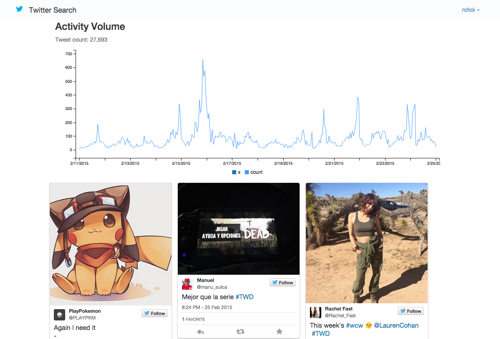
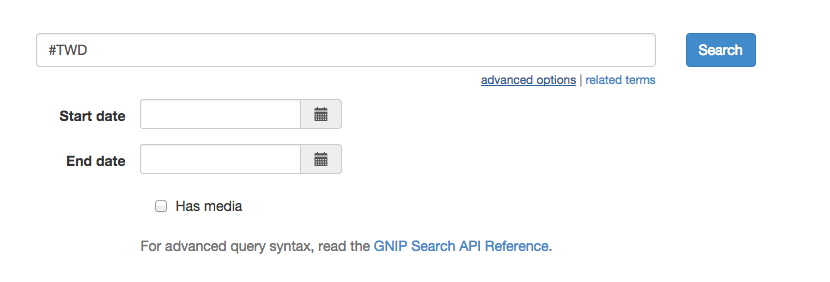
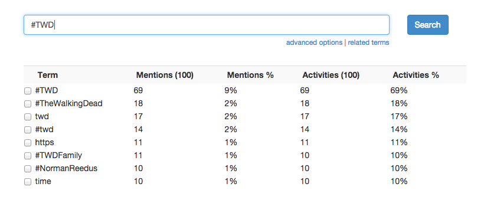

Tweet Search
=================

This sample uses GNIP search to show the activity volume and latest tweets on any given topic. It also renders tweets using Twitter's widgets.js.

As always, when developing on top of the Twitter platform, you must abide by the [Developer Agreement & Policy](https://dev.twitter.com/overview/terms/agreement-and-policy). 

Requirements
============

To run this sample code, you can install the required libraries with:

	`pip install -r requirements.txt`

Getting Started
============

- Create a Twitter App (https://apps.twitter.com/)

- Specify your API and GNIP credentials in app/settings.py under the following section:

	GNIP_USERNAME = 'YOUR_GNIP_USERNAME'
	GNIP_PASSWORD = 'YOUR_GNIP_PASSWORD'
	GNIP_SEARCH_ENDPOINT = 'YOUR_GNIP_SEARCH_ENDPOINT'

- To initialize your database, run the from the `tweet-search` directory:

  `python manage.py syncdb`

- To start the server, run the following from the `tweet-search` directory:

  `fab start`
  
- Open a browser and go to http://localhost:9000

Sample Queries
============

Some sample queries to run:

- Hashtag search (default AND): `#MLB #SFGiants`
- Mention search, no retweets: `@TwitterDev -(is:retweet)`
- Search with images/videos: `walking dead (has:media)`

Advanced Options
============

In the UI, there is a link to show advanced options. Specifically:

- Start/end dates. GNIP search allows a variable timeframe to search, with a maximum of 30 days ago.
- Has media. This appends `(has:media)` to your query 

Related Terms
============

The GNIP search can also suggest additional related terms to add to your query. Click on the 'related terms' 
link and a drop-down will appear to suggest (and add) additional terms to your query:

